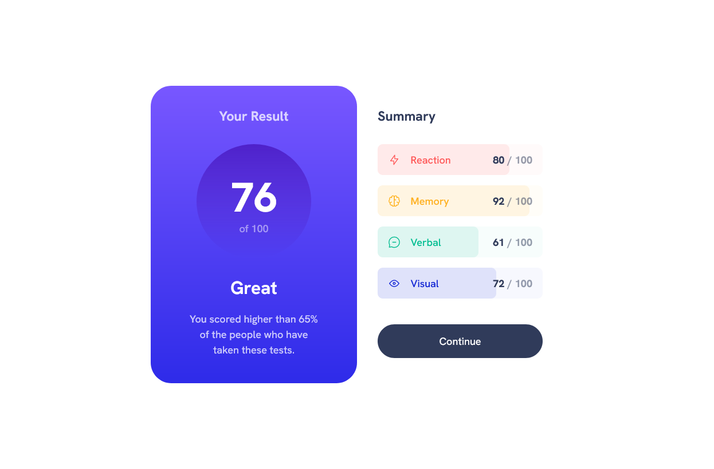

# Frontend Mentor - Results summary component solution

This is a solution to the [Results summary component challenge on Frontend Mentor](https://www.frontendmentor.io/challenges/results-summary-component-CE_K6s0maV). Frontend Mentor challenges help you improve your coding skills by building realistic projects.

## Table of contents

-   [Overview](#overview)
    -   [The challenge](#the-challenge)
    -   [Screenshot](#screenshot)
    -   [Links](#links)
-   [My process](#my-process)
    -   [Built with](#built-with)
    -   [Continued development](#continued-development)
    -   [Useful resources](#useful-resources)
-   [Author](#author)

## Overview

### The challenge

Users should be able to:

-   [x] View the optimal layout for the interface depending on their device's screen size
-   [x] See hover and focus states for all interactive elements on the page
-   [x] **Bonus**: Use the local JSON data to dynamically populate the content

Things yet to implement:

-   [ ] Box shadow for root card
-   [ ] Animations
    -   [ ] Button hover transition
    -   [ ] Progress bars loading animations
    -   [ ] Counting up the score on result card

Things I _might_ implement:

-   [ ] Interactive values (with hooks)
-   [ ] Action on button click (either one of):
    -   Overlay
    -   Rendering a page

### Screenshot

### Links

-   [Solution URL](https://www.frontendmentor.io/solutions/results-summary-component-with-progress-bars-and-automatic-values-YLcY0oQhEw)
-   [Live Site URL](https://nikkehtine-fm.github.io/results-summary-component/)

## My process

### Built with

-   Responsive Web Design
-   Flexbox
-   CSS Grid
-   [React](https://react.dev/) - JS library
-   [Styled Components](https://styled-components.com/) - Library for adding styles to React components

### Continued development

Things I have to still learn:

-   Proper React workflow
-   Hooks

### Useful resources

-   [React Docs](https://react.dev/learn/passing-props-to-a-component) - The official React docs are well written and a very good resource for learning React.
-   [TypeScript](https://www.typescriptlang.org/docs/) - TypeScript docs are another invaluable resource for working with TypeScript.
-   [Passing props to a component in React Docs](https://react.dev/learn/passing-props-to-a-component) - Passing props to a child component gave me a bit of a headache, but looking into the docs cleared most things up for me.
-   [Rendering lists in React Docs](https://react.dev/learn/rendering-lists)
-   [Working with JSX in TypeScript Docs](https://www.typescriptlang.org/docs/handbook/jsx.html) - This page in the TS documentation explains various ways to best utilize TypeScript in JSX.
-   [CSS Progress Bar Tutorial by Web Dev Simplified on YouTube](https://www.youtube.com/watch?v=basf1lH1H-E) - This is an amazing channel, and the tutorial was informative and easy to follow.

## Author

-   Frontend Mentor - [@nikkehtine](https://www.frontendmentor.io/profile/nikkehtine)
-   Twitter - [@nikkehtine](https://twitter.com/nikkehtine)
